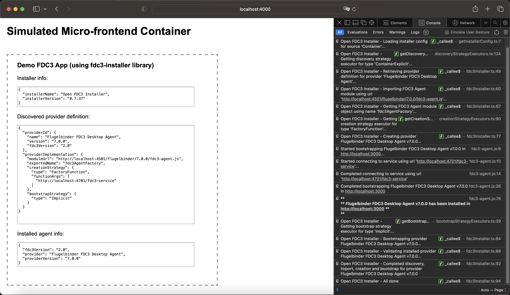

# fdc3-installer

## Overview

`fdc3-installer` aims to provide a solution to the problem in browser-based environments of tight coupling between [FDC3](https://fdc3.finos.org)-enabled apps and [FDC3 Desktop Agents](https://fdc3.finos.org/docs/api/ref/DesktopAgent).

The library supports multiple strategies for the areas of agent discovery, creation and bootstrapping - with the ability to easily add additional strategies based on any subsequent discussion / ideas.

Ultimately the library decouples FDC3-enabled apps from any specific browser-based agent implementation - providing a mechanism for dynamically discovering and installing an agent within an app at runtime. This approach allows an app to run both in a desktop container (using the container's built-in agent) and also in a browser-based micro-frontend container (using a dynamically-installed agent) with zero code changes to the app.


## Background

When an FDC3-enabled app runs in a desktop container, the app is fully agnostic of the FDC3 Desktop Agent. This is because the agent is provided to the app by the desktop container - the app itself has no role in the selection or installation of the agent at all.

The advent of browser-based FDC3 Desktop Agents presents a key challenge in terms of the selection and installation of an agent. Specifically, outside of browser extension technology it is *not* possible to inject *any* JavaScript code into another window on a cross-origin basis at runtime. Any reliance on browser extensions for mission-critical enterprise apps is generally problematic for companies (and their customers) from a risk perspective e.g. single point of failure, loss of control, and - most notably - InfoSec requirements.

Up until now, this has typically led to an undesirable build-time tight-coupling between an FDC3-enabled app and the agent that it relies upon for interop - with the agent either being included in the built application's script bundles, or if not then still explicitly included in the application's host page via a separate script tag. Although this tight coupling has the benefit of simplicity for browser-based app development, the important point to be aware of is that it breaks FDC3's spirit of openness i.e. the idea that apps should not be tied to a specific FDC3 Desktop Agent. This makes any such implementations non-compliant with the FDC3 standard at the current time (with the recommendation from the WG that they should not be promoted or used).

The `fdc3-installer` library does not claim to have all the answers but is intended to provide a working implementation and demonstration of some of the options for a solution in this area. It is hoped that this will help get the discussion going within the FDC3 community about how we can best overcome the tight-coupling problem for browser-based FDC3 Desktop Agent implementations. Ultimately, a standardized approach will be necessary in order for browser-based implementations to become compliant with the FDC3 standard.




## Installation

To access the `fdc3-installer` API in your application, simply install the `fdc3-installer` npm package:

```sh
# npm
npm install fdc3-installer

# yarn
yarn add fdc3-installer

# pnpm
pnpm install fdc3-installer
```


## Usage

The `fdc3-installer` library can be used as follows:

```TypeScript
import { fdc3Ready, getInfo, ImplementationMetadata } from '@finos/fdc3';
import { fdc3Installer, InstallerConfigSource } from 'fdc3-installer';

// Discover, import, create and bootstrap an FDC3 Desktop Agent (using either InstallerConfigSource.Container or InstallerConfigSource.App)
const { providerDefinition, fdc3 } = await fdc3Installer.installAgent(InstallerConfigSource.Container);

// Use FDC3 API methods as normal, based on whatever FDC3 Desktop Agent was installed above
await fdc3Ready();
const agentImpMetadata: ImplementationMetadata = await getInfo();

// Note that as an alternative to using the  getInfo()  wrapper function above, we could instead use  fdc3.getInfo()
// This is because the  fdc3Installer.installAgent()  method actually returns the FDC3 Desktop Agent instance alongside the provider definition.
```

Where possible, the recommended usage for `fdc3-installer` is to specify `InstallerConfigSource.Container` rather than `InstallerConfigSource.App` so that the installer config is simply provided by the micro-frontend container - rather than by the individual apps. Additionally, the ideal scenario would be to have that config specify a `ContainerExplicit` discovery strategy rather than one of the `AppXXX` strategies (see the rest of the README for details). Taking this approach would most closely align the behaviour of the browser-based environment with that provided by desktop containers (where the app also has no input on the provision of the FDC3 Desktop Agent).

However, one limitation of the above recommendation is that it presupposes the existence of a micro-frontend container to launch and host individual applications. In the case of a browser-based agent that relies on native local cross-origin messaging under the hood (e.g. via [postMessage](https://developer.mozilla.org/en-US/docs/Web/API/Window/postMessage) and [addEventListener](https://developer.mozilla.org/en-US/docs/Web/API/EventTarget/addEventListener) browser API methods) it's likely that a parent container would be needed in any case (otherwise the app windows would be unable to send/receive messages on a cross-origin basis). However, in the case of a cloud-based agent (i.e. relying on WebSockets) there is no requirement to have a container for orchestration / routing purposes or to spawn / host the individual app windows - and therefore a container may not be part of the structure at all. However, this type of *containerless* environment could still be supported by `fdc3-installer` using `InstallerConfigSource.App` for the installer config, along with one (but not *all* of) of the `AppXXX` discovery strategies.


## Key Features

The key features of this library for the purposes of browser-based FDC3-enabled apps are as follows:

- Apps no longer have to include an FDC3 Desktop Agent implementation at build/packaging-time.
- Apps are not tied to a specific FDC3 Desktop Agent.
- Apps can run in multiple browser-based containers, or as stand-alone browser-based apps, or in desktop containers - all with zero code changes to the apps.
- The FDC3 Desktop Agent used by a given app is dynamically discovered and installed at runtime.
- Multiple strategies are available for discovering an FDC3 Desktop Agent.
- Discovery strategies involve using some aspect of the app or its container to select an FDC3 Desktop Agent.
- Additional discovery strategies can easily be implemented.
- Utilises an installer config file to facilitate discovery and installation of FDC3 Desktop Agent.


## Use Case 1: FDC3 App Interop Using Hardcoded Agents

### Preconditions

- A number of browser-based FDC3 Desktop Agents are available, including:
  - Agent A
  - Agent B
- Vendor 1 chooses to use Agent A and installs it inside its app.
- Vendor 1 has never dealt with Agent B at all - and has no current plans to do so.

### Workflow 1

Company X has an in-house app which also uses **Agent A** - so they can **successfully** use FDC3 interop between Vendor App 1 and their in-house app.

TODO - Add diagram here

### Workflow 2

Company Y has an in-house app which instead uses **Agent B** - and is therefore **unable** to use FDC3 interop with Vendor App 1.

TODO - Add diagram here


## Use Case 2: FDC3 App Interop Using Container-Based Discovery

### Preconditions (in detail)

- A number of browser-based FDC3 Desktop Agents are available, including:
  - Agent A
  - Agent B
  - several others
- Vendor 1 implements its app as follows:
  - *does not* directly install any specific agent
  - installs the `fdc3-installer` package
  - adds a single-line import statement
  - adds a single-line `fdc3Installer.installAgent(InstallerConfigSource.Container)` invocation
  - *does not* need to create an `fdc3-installer-config.json` file
- Company X implements its in-house app as follows:
  - installs, imports and invokes `fdc3-installer` with `InstallerConfigSource.Container`
  - adds an `fdc3-installer-config.json` file in the root of their browser-based container, configuring it with a `ContainerExplicit` discovery strategy that specifies Agent A
- Company Y implements its in-house app as follows:
  - installs, imports and invokes `fdc3-installer` with `InstallerConfigSource.Container`
  - adds an `fdc3-installer-config.json` file in the root of their browser-based container, configuring it with a `ContainerExplicit` discovery strategy that specifies Agent B

### Workflow 1

- Company X can successfully use FDC3 interop between Vendor App 1 and their in-house app using **Agent A**.
- They are also free to switch over to use another agent (or even switch to using a desktop container) if they like, with zero FDC3-related code changes required to either Vendor App 1 or to their in-house app.

TODO - Add diagram here

### Workflow 2

- Company Y can successfully use FDC3 interop between Vendor App 1 and their in-house app using **Agent B**.
- They are also free to switch over to use another agent (or even switch to using a desktop container) if they like, with zero FDC3-related code changes required to either Vendor App 1 or to their in-house app.

TODO - Add diagram here


## Design Decisions

- The installer should first check whether there is already an FDC3 Desktop Agent installed in the `window.fdc3` object. If an agent is already installed (e.g. because the app is running within a desktop container) then the library should simply log this information to the console and not undertake any further work. This will allow an app using the library to be run in either a desktop container or in a browser without any code changes to the app - and without any concerns about whether the library might inadvertently overwrite an existing agent.
- An app should only be able to use one agent at a time. The idea of using using multiple agents goes well beyond the current FDC3 spec, and arguably would significantly complicate app workflows.
- As per the current FDC3 spec, agents should ultimately be responsible for installing themselves into `window.fdc3`. This allows the existing wrapper functions in [@finos/fdc3](https://github.com/finos/FDC3) to be used without any change. We should seek to avoid any other approach to installing an FDC3 Desktop Agent at the present time, as it would break backwards compatability with the FDC3 standard that existing apps rely on. Note that the installer will not undertake installation into `window.fdc3`; rather, this installation is left to the agent implementation itself (when it gets loaded and created by the installer). This is partly because of the potential conflict if both the agent implementation *and* the installer attempted to install into `window.fdc3`. An additional reason is that the installer should seek to avoid dealing with issues around implicit/explicit agent bootstrapping and/or risking breaking `fdc3Ready()` behaviour. A change to this decision would be possible, but would need further thought (and would probably also require specific recommendations around how browser-based FDC3 Desktop Agent implementations are provided in JavaScript modules).
- Within a given session, it should not be possible to switch agent implementations after one has initially been selected and installed:
  - allowing this behaviour could lead to difficult and unnecessary corner cases related to a previous agent's subscriptions, etc.
  - even if a standardized mechanism for unloading an agent was defined in the spec, allowing switching during the session would require the app to reinstate listeners using the new agent.
  - I can't think of a good reason (at the moment) why anyone would want to switch agents during a session.
- It should be possible for an app to install an agent using a single line of code. This makes the concept more accessible, which should encourage adoption. Additionally, it makes sense to have all installation configuration outside of the app's code. If the library required significant config within the app's codebase, that would make it more likely for the app to require rebuilding in order to use a different agent. Finally, the use of JSON installer config files allows the app's CI/CD process to provide a config at packaging / deployment time - which can avoid the need for each app to keep its own copy of what could typically be a standardized config.
- The agent selection process should *not* require any user input. An end-user should not need to know about FDC3 Desktop Agents, or that different agent implementations may be used in different circumstances. They should simply be able to rely on their apps to automatically configure themselves in order to run successfully, supporting the interop required to facilitate the end-user's workflows.
- Avoid holding a directory of FDC3 Desktop Agent implementations within the library package, because doing so would likely be a bad idea for a number of reasons. An installer library is not a good place to maintain these type of details on an ongoing basis, not least because it might imply including implementations that are proprietary, or still under development, or that should no longer be recommended for usage in new app development (and it would also require publication of a new version of the library package whenever a new agent implementation became available).
- Rely on an installer config file (rather than inline code within the app) for agent selection. This allows discovery strategy to be defined at runtime (in the case of all the strategies except one) or at the very least at deploy-time (in the case of the AppExplicit strategy) rather than requiring definition at app build/packaging time.
- The installer library does not (at least at the moment) need be tied to a specific version of the FDC3 standard. The general process of discovery and installation is not specific to the version of agent that is being installed (the only exception to this is the optional validation of the installed agent, which requires invoking the agent's `getInfo()` method in order to check the `ImplementationMetadata` properties against the properties in the provider directory).


## Runtime Agent Installation Process

The phases of the installation process executed by the library's `installAgent()` method are as follows:

- Load the installer config.
  - file is JSON format and must be named `fdc3-installer-config.json`.
  - config will be loaded from the root of either the container origin or the app origin, depending on whether InstallerConfigSource.Container or InstallerConfigSource.App is passed as an argument to the `installAgent()` method.
  - if config is loaded from the container origin - and assuming the container origin differs from the app origin - then the use of [Fetch API](https://developer.mozilla.org/en-US/docs/Web/API/Fetch_API) for the load process means that the config file will need to be returned with valid [CORS](https://developer.mozilla.org/en-US/docs/Web/HTTP/CORS) headers.
  - provider directory can be defined either inline within the config (`providerDirectory` property) or externally via the `providerDirectoryUrl` property.
- Discover the agent (i.e. provider identifier) using the strategy from the config (multiple strategies supported).
- Retrieve the provider definition from the provider directory using the discovered provider identifier.
- Dynamically import the agent implementation (i.e. exported module object). The use of a dynamic [import()](https://developer.mozilla.org/en-US/docs/Web/JavaScript/Reference/Operators/import) expression means that in most cases the agent implementation's JavaScript file will need to be returned with valid [CORS](https://developer.mozilla.org/en-US/docs/Web/HTTP/CORS) headers.
- Create agent using the strategy from the config (multiple strategies supported).
- Bootstrap agent using the strategy from the config (implicit or explicit strategy).
- Validate the agent that has been imported/installed against the provider definition (this validation is optional, and is only performed if the `validateProvider` property is set to `true` in the `discoveryStrategy` section of the installer config).


## Strategies For Agent Installation

The library has been deliberately structured in such a way as to make it easy to play around with new strategies. This could be particularly beneficial in the case of the discovery strategy implementations because there may well be other, better strategies than the ones implemented in the initial iteration of the library. Outside input would definitely help in exploring and developing additional ideas in this area.

### Discovery Strategies Explanation

| Discovery Strategy | Explanation |
| ------------------ | ----------- |
| ContainerExplicit  | Use a specific agent for all apps running in the container. This is effectively the same approach used by desktop containers today i.e. the container provides the agent, and all apps launched by and running in the container always use the same agent. |
| ContainerOrigin    | Infer the agent from the container's origin by using a set of mappings. This allows multiple *deployments* of the same container on different subdomains to use their preferred agent. |
| AppExplicit        | Use a specific agent for the app. Note that this does tie a *deployment* of the app to a specific agent, but it at least avoids the *build/packaging* of the app being tied to a specific agent. |
| AppOrigin          | Infer the agent from the app's origin by using a set of mappings. This allows multiple *deployments* of the same app on different subdomains to use their preferred agent. |
| AppQuerystring     | Infer the agent from one of the app's querystring params by using a set of mappings. This allows a container to tell the app which agent to use by specifying a querystring on the app's url when launching the app in an iframe or an external window. |
| AppWindowName      | Infer the agent by using the app's `window.name` property to get a string containing ordinal position values that have been projected through to the app window from the micro-frontend container that spawned it. This projection from container to app is possible by means of the one-time binding for an [iframe](https://developer.mozilla.org/en-US/docs/Web/HTML/Element/iframe)'s `name` attribute, a [window.open()](https://developer.mozilla.org/en-US/docs/Web/API/Window/open)'s `target` argument, or an [anchor](https://developer.mozilla.org/en-US/docs/Web/HTML/Element/a)'s `target` attribute. |
| AppSessionStorage  | Infer the agent by reading the properties of an object from the app's [sessionStorage](https://developer.mozilla.org/en-US/docs/Web/API/Window/sessionStorage). This could potentially be used if sessionStorage was set during a previous app initialization step e.g. immediately after an SSO process. For example, an agent could theoretically be specified at runtime on a per-customer, a per-user or a per-entitlement basis. |

One concern with the `AppQuerystring` strategy if used an a situation where individual apps can run in their own windows / tabs (as opposed to only running within iframes) is bookmarking. Specifically, the application would be *unable* to prevent the user from bookmarking the app's url - despite this being a bad idea because the url contained a querystring param value that effectively fixed the app to a specific FDC3 Desktop Agent. This might allow the bookmarked app to subsequently work in *some* situations (where the FDC3 Desktop Agent just happened to be appropriate) but the app would break in all other situations. This would result in a confusing user experience that would ultimately be blamed on the app in the first instance (rather than on the user bookmark operation).

Note that one potential issue with the the `AppWindowName` strategy might be the mechanics of an agent's `fdc3.open()` method. In particular, when that method was used to open a new app (or a new instance of an existing app) then it would need to ensure that the new app used the same agent as the app that opened it - otherwise it would render cross-app FDC3 interop impossible. The implication is that this particular discovery strategy could probably only be used in practice for a set of agent implementations which guaranteed to project the (same) required provider details through to all iframes, windows or tabs opened via `fdc3.open()`. Clearly, this would require a very specific assumption about how those agents implemented `fdc3.open()`, and would therefore imply that the strategy could not be used for *all* agents.

### Creation Strategies Explanation

| Creation Strategy    | Explanation |
| -------------------- | ----------- |
| ClassInstance        | Exported module object is a class instance i.e. an fdc3 object. |
| Class                | Exported module object is a class like Fdc3, where the installer needs to construct an instance using new Fdc3(..), passing any constructor args that have been specified in the config. |
| FactoryFunction      | Exported module object is a factory function like fdc3AgentFactory which the installer needs to invoke using fdc3AgentFactory(..), passing any function args that have been specified in the config. |
| FactoryClassInstance | Exported module object is a factory class instance, where the installer needs to invoke like fdc3AgentFactory.xxx(..), using the specific method name and any method args that have been specified in the config. |
| FactoryClass         | Similar to FactoryClassInstance above, but the key difference being before that work is done, the installer first needs to construct an instance of the factory class using new Fdc3AgentFactory(..), passing any constructor args that have been specified in the config. |
| StaticFactoryClass   | From the installer's perspective in terms of what it needs to invoke, this is effectively the same as FactoryClassInstance. |

Note that if in future there was a specific standard setting out how a browser-based FDC3 Desktop Agent must be provided (e.g. that it *must* be via a factory function, and never by any other mechanism) then it would be possible to remove the choice of creation strategies from this library altogether - because only a single mechanism would then be required. Unless or until there is such a standard though, it will be necessary to support multiple creation strategies (failure to do so would mean that some FDC3 Desktop Agents might be impossible to install dynamically at runtime using this library).


### Bootstrap Strategies Explanation

| Bootstrap Strategy | Explanation |
| ------------------ | ----------- |
| Implicit           | The agent implicitly boostraps itself when it is loaded and created, and therefore the installer has no work to do. |
| Explicit           | The agent requires an explicit boostrap, so the installer needs to invoke a (non-standard) fdc3.xxx(..) method, using the specific method name and any method args that have been specified in the config. |

Note that - as was also the case with the creation strategies above - it would also be theoretically possible to remove the choice for bootstrap strategies from this library as well. However, this would only be possible if a specific standard was set out for how browser-based FDC3 Desktop Agents should be boostrapped.


## What's Included In This Repo?

This repo contains:

 - Source code for the `fdc3-installer` library.
 - Example Javascript-based stub FDC3 Desktop Agent implementations.
 - Sample browser-based app which uses `fdc3-installer` to install one of agents at runtime.
 - Simulated browser-based micro-frontend container. This is of course not a proper container - it is simply a bare-bones container to allow the sample app to be tested in the context of a container structure.

Note that the library author is unable to include a full FDC3 Desktop Agent in this repo. Although the author has worked on one recently, that particular implementation is proprietary to his employer. However, the example agent implementations (which simply implement a `fdc3.getInfo()` method) should be enough to demonstrate usage of `fdc3-installer`, and to provide a template showing how a real agent implementation module can be exposed to `fdc3-installer`.


## Instructions For Running The Demo App

The demo consisters of a simple container, app and FDC3 Desktop Agents to show `fdc3-installer` in use. To install the demo, run the following commands:
```sh
cd demo-app
npm i
```

Start the Acme FDC3 Desktop Agent in a terminal using the following commands:
```sh
npm run start:agent1
```

Start the Flugelbinder FDC3 Desktop Agents in a terminal using the following commands:
```sh
npm run start:agent2
```

Start the Simulated Micro-frontend Container in a terminal using the following commands:
```sh
npm run start:container
```

Start the App in a terminal using the following commands:
```sh
npm run start:app
```

Now simply point your browser to the following location to run the full demo:
```
http://localhost:4000
```

Note that this is a very limited demo, simply showing a *happy path* using a container-based installer config with a ContainerExplicit discovery strategy. It does not use a real container, or a real app, or real FDC3 Desktop Agents - but it uses broadly the same structure that can be used with real-world browser-based container / apps / agents.

The demo app included in this repo inside the `public-app` folder was deliberately created using vanilla JavaScript instead of using a proper framework / bundler. This was done for simplicity's sake to avoid any requirement to build the app before running.

However, you can of course install and run the `fdc3-installer` library inside your own application using a proper framework / script bundler of your choice (see 'Installation' and 'Usage' sections above for details). To understand the range of options supported, it is recommended to play around with different strategies in an installer config and to also test out the *unhappy path*.


## Outstanding Work

- Implement remaining discovery strategies (AppWindowName, AppSessionStorage).
- Implement remaining creation strategies (FactoryClass, StaticFactoryClass).
- Support a default for the bootstrapStrategy object in the installer config as it should not need specifying in order to default to `BootstrapStrategyType.Implicit`. (Could possibly consider a default for the creationStrategy object as well - `CreationStrategyType.FactoryFunction` could be a good choice but any default for creationStrategy could perhaps be contentious).
- Improve the mechanism for discovering the container origin, to allow it to be flexible enough to work for more than just the two simple scenarios currrently supported (see `getContainerOrigin()`).
- Investigate the problem of undesirable rewriting of [import()](https://developer.mozilla.org/en-US/docs/Web/JavaScript/Reference/Operators/import) expressions at packaging-time by common JavaScript module bundlers, which can result in a broken agent installation process if not mitigated against. The `fdc3Installer.installAgent()` method deliberately includes a [Webpack Magic Comment](https://webpack.js.org/api/module-methods/#magic-comments) (`/* webpackIgnore: true */`) in its `import()` expression in order to force Webpack to disable dynamic import parsing (which Webpack normally performs to support chunking and lazy loading) when the library is used inside an application. If that Magic Comment had *not* been included, then although `fdc3-installer` would work in simple vanilla JavaScript applications, it would break when used in what is probably the most commonly used web application scaffolding and framework at the moment ([Create React App](https://create-react-app.dev)-based [React](https://reactjs.org) applications, which rely on Webpack for module bundling). But the question that now needs to be asked is: are there any other commonly-used JavaScript module bundlers which the installer library should also mitigate against?
- Investigate and address security considerations for browser-based importer libraries and for browser-based FDC3 Desktop Agents. Some of these are listed here, but this is certainly not an exhaustive list:
  - Firstly, it is worth noting that the native JavaScript import() expression is a function-like expression but not actually a function. This means that it is part of that very exclusive club of native APIs in JavaScript (like window.location) that *cannot* be monkey patched at runtime by a XSS attack.
  - Since monkey patching is allowed on almost everything in JavaScript (including the native browser APIs) there are a number of possible XSS attack vectors that could be used to compromise an agent ranging from the APIs an agent relies upon (e.g. postMessage, addEventListener or WebSocket APIs) to the installer library itself (e.g. even though import() cannot be patched to download malicious code from a different site, the installer API could be patched to use a different moduleName argument for the import() expression).
   not only could a browser-based FDC3 Desktop Agent's functionality
  - It should be borne in mind that with some exceptions (FDC3 Sail being one) even the FDC3 Desktop Agents provided by desktop containers are generally not immune from XSS attacks on the FDC3-enabled apps that rely on them. In particular, the `window.fdc3` object can routinely be monkey patched at runtime. The FDC3 spec currently does not currently recommend or require agent implementers to freeze the `fdc3` object to prevent its methods being overwritten at runtime, or to make the `fdc3` property of the `window` non-configurable / non-writable to prevent the whole object being reassigned at runtime.
  - The affect of [Content Security Policy](https://developer.mozilla.org/en-US/docs/Web/HTTP/CSP) on the use of the import() expression - this **absolutely requires further invetigation**.
  - The impact of using a dynamic import() expression on the perception that the installer library can be trusted e.g. what will services aiming to provide information about npm package security vulnerabilities (e.g. Mend, formerly WhiteSource) report about the installer library? This also **absolutely requires further invetigation**.
- Consider supporting a new `InstallerConfigSource.Custom` option along with a second argument to the `fdc3Installer.installAgent()` method to allow arbitrary installer config urls, rather than just limiting to a specific origin and filename. This extension would:
  - provide flexibility to place installer config files in other folder structures within the container or app
  - support REST endpoints as well as just a specifically-named static JSON file
  - allow an app to specify a container-based url in the case where the installer library could not easily locate it e.g. more complex window-spawning or iframe-nesting.
  - but note that the potential downside of this greater flexibility is that it could increase the chances of different apps specifying the wrong url when dealing with a custom config source for a container
- Consider an additional creation strategy to support old-style regular JavaScript script files, as well as just the JavaScript module files that are already supported.
- Consider supporting the optional functionality to install an agent into `window.fdc3` where that agent does not self-install (this would be based on a new property in the providerImplementation object in the provider directory.
- Fix problem where app fetching installer config from container level (as opposed to from app level) causes any relative url used for providerDirectoryUrl property to be relative to the app origin rather than the container origin. This seems wrong, so look at what we can do to improve this.
- If multiple provider definitions are found, should we (config-optionally) warn and install one of them (which one?) rather than erroring?
- Consider improving validateAgent() since its naive string-based equality testing for version / fdc3Version would actually fail validation an example like '1.2' against '1.2.0'.
- Consider using semver for matching versions between discoveryStrategy's providerId and providerDirectory's providerId.
- Change fdc3Installer.getInfo() method to obtain version from a better location e.g. package.json rather than static installerMetadata.ts file.
- Unit tests.
- JSON schemas for installer config and provider directory.


## Installer Config and Provider Directory

The library's `installAgent()` method will load the `fdc3-installer-config.json` file from root of either the container origin or the app origin. The choice of origin when loading the installer config is governed by what the app passes to the `installAgent()` method (either `InstallerConfigSource.Container` or `InstallerConfigSource.App`).

The structure of the config file is as shown below. It requires a single `discoveryStrategy` object to facilitate the selection of an agent (note also the `validateProvider` subproperty that optionally allows an agent to be validated after install). The config can either specify an inline `providerDirectory` array or a `providerDirectoryUrl` property pointing to an external provider directory file (containing an equivalent array). Each provider definition within the provider directory specifies a `providerImplementation` object which tells the library where and how to import, create and bootstrap the agent.

Note that `providerDirectoryUrl` does not need to point to a static file (as shown in the example structure below). It could just as easily point to a service which looks up the provider definitions from a database or elsewhere.

Note also that if an inline `providerDirectory` array is defined within the installer config, this will always take precedence over any `providerDirectoryUrl`-based externally-defined equivalent.

### Structure Using Inline Provider Directory

`fdc3-installer-config.json`:

```JSON
{
  "discoveryStrategy": {
    "type": "<DiscoveryStrategyType>",
    ...
    "validateProvider": true
  },
  "providerDirectory": [
    {
      "providerId": {
        "name": "<agentNameString>",
        "version": "<agentVersionString>",
        "fdc3Version": "<agentFdc3VersionString>"
      },
      "providerImplementation": {
        "moduleUrl": "http://<someDomain>/<somePath>/<someName>.js",
        "exportedName": "<exportedNameOrDefault>",
        "creationStrategy": {
          "type": "<CreationStrategyType>",
          ...
        },
        "bootstrapStrategy": {
          "type": "<BootstrapStrategyType>",
          ...
        }
      }
    },
    ...
  ]
}
```

### Structure Using External Provider Directory

`fdc3-installer-config.json`:

```JSON
{
  "discoveryStrategy": {
    "type": "<DiscoveryStrategyType>",
    ...
    "validateProvider": true
  },
  "providerDirectoryUrl": "fdc3-provider-directory.json"
}
```

`fdc3-provider-directory.json`:

```JSON
[
  {
    "providerId": {
      "name": "<agentNameString>",
      "version": "<agentVersionString>",
      "fdc3Version": "<agentFdc3VersionString>"
    },
    "providerImplementation": {
      "moduleUrl": "http://<someDomain>/<somePath>/<someName>.js",
      "exportedName": "<exportedNameOrDefault>",
      "creationStrategy": {
        "type": "<CreationStrategyType>",
        ...
      },
      "bootstrapStrategy": {
        "type": "<BootstrapStrategyType>",
        ...
      }
    }
  },
  ...
]
```


## Discovery Strategies (Example Config Fragments)

### ContainerExplicit

```JSON
"discoveryStrategy": {
  "type": "ContainerExplicit",
  "providerId": {
    "name": "Flugelbinder FDC3 Desktop Agent",
    "version": "7.0.0"
  },
  "validateProvider": true
}
```

### ContainerOrigin

```JSON
"discoveryStrategy": {
  "type": "ContainerOrigin",
  "originProviderIdMappings": [
    {
      "origin": "http://localhost:4000",
      "providerId": {
        "name": "Acme FDC3 Desktop Agent",
        "version": "4.0.0"
      }
    },
    {
      "origin": "http://localhost:4001",
      "providerId": {
        "name": "Flugelbinder FDC3 Desktop Agent",
        "version": "6.0.0"
      }
    }
  ],
  "validateProvider": true
}
```

### AppExplicit

```JSON
"discoveryStrategy": {
  "type": "AppExplicit",
  "providerId": {
    "name": "Flugelbinder FDC3 Desktop Agent",
    "version": "7.0.0"
  },
  "validateProvider": true
}
```

### AppOrigin

```JSON
"discoveryStrategy": {
  "type": "AppOrigin",
  "originProviderIdMappings": [
    {
      "origin": "http://localhost:3000",
      "providerId": {
        "name": "Acme FDC3 Desktop Agent",
        "version": "4.0.0"
      }
    },
    {
      "origin": "http://localhost:3001",
      "providerId": {
        "name": "Flugelbinder FDC3 Desktop Agent",
        "version": "6.0.0"
      }
    }
  ],
  "validateProvider": true
}
```

### AppQuerystring

```JSON
"discoveryStrategy": {
  "type": "AppQuerystring",
  "paramName": "providerUuid",
  "paramValueProviderIdMappings": [
    {
      "paramValue": "b1dfb9b2-5657-4ab6-9a06-5534405fe502",
      "providerId": {
        "name": "Acme FDC3 Desktop Agent",
        "version": "4.0.0"
      }
    },
    {
      "paramValue": "c4d3408e-6b8b-4148-8f19-55a949e96adb",
      "providerId": {
        "name": "Flugelbinder FDC3 Desktop Agent",
        "version": "6.0.0"
      }
    }
  ],
  "validateProvider": true
}
```

### AppWindowName

```JSON
"discoveryStrategy": {
  "type": "AppWindowName",
  "valueDelimiter": ";",
  "providerNameOrdinal": 2,
  "providerVersionOrdinal": 3,
  "providerFdc3VersionOrdinal": 4,
  "validateProvider": true
}
```

### AppSessionStorage

```JSON
"discoveryStrategy": {
  "type": "AppSessionStorage",
  "keyName": "providerID",
  "providerNameValuePath": "name",
  "providerVersionValuePath": "version",
  "providerFdc3VersionValuePath": "fdc3Version",
  "validateProvider": true
}
```


## Creation Strategies (Example Config Fragments)

### ClassInstance

```JSON
"creationStrategy": {
  "type": "ClassInstance"
}
```

### Class

```JSON
"creationStrategy": {
  "type": "Class",
  "constructorArgs": [
    "http://localhost:4401/fdc3-service"
  ]
}
```

### FactoryFunction

```JSON
"creationStrategy": {
  "type": "FactoryFunction",
  "functionArgs": [
    "http://localhost:4701/fdc3-service"
  ]
}
```

### FactoryClassInstance

```JSON
"creationStrategy": {
  "type": "FactoryClassInstance",
  "methodName": "create",
  "methodArgs": [
    "http://localhost:4701/fdc3-service"
  ]
}
```

### FactoryClass

```JSON
"creationStrategy": {
  "type": "FactoryClass",
  "constructorArgs": [
    "someArg1Value",
    "someArg2Value"
  ]
  "methodName": "create",
  "methodArgs": [
    "http://localhost:4701/fdc3-service"
  ]
}
```

### StaticFactoryClass

```JSON
"creationStrategy": {
  "type": "StaticFactoryClass",
  "methodName": "create",
  "methodArgs": [
    "http://localhost:4701/fdc3-service"
  ]
}
```


## Bootstrap Strategies (Example Config Fragments)

### Implicit

```JSON
"bootstrapStrategy": {
  "type": "Implicit"
}
```

### Explicit

```JSON
"bootstrapStrategy": {
  "type": "Explicit",
  "methodName": "bootstrap",
  "methodArgs": [
    "http://localhost:4701/fdc3-service"
  ]
}
```


## Sample Container-level `fdc3-installer-config.json` File (Full Config)

```JSON
{
  "discoveryStrategy": {
    "type": "ContainerExplicit",
    "providerId": {
      "name": "Flugelbinder FDC3 Desktop Agent",
      "version": "7.0.0"
    },
    "validateProvider": true
  },
  "providerDirectory": [
    {
      "providerId": {
        "name": "Acme FDC3 Desktop Agent",
        "version": "4.0.0",
        "fdc3Version": "1.2"
      },
      "providerImplementation": {
        "moduleUrl": "http://localhost:4500/acme/4.0.0/fdc3-agent.js",
        "exportedName": "default",
        "creationStrategy": {
          "type": "ClassInstance"
        },
        "bootstrapStrategy": {
          "type": "Implicit"
        }
      }
    },
    {
      "providerId": {
        "name": "Flugelbinder FDC3 Desktop Agent",
        "version": "6.0.0",
        "fdc3Version": "1.2"
      },
      "providerImplementation": {
        "moduleUrl": "http://localhost:4501/flugelbinder/6.0.0/fdc3-agent.js",
        "exportedName": "fdc3",
        "creationStrategy": {
          "type": "ClassInstance"
        },
        "bootstrapStrategy": {
          "type": "Explicit",
          "methodName": "bootstrap",
          "methodArgs": [
            "http://localhost:4601/fdc3-service"
          ]
        }
      }
    },
    {
      "providerId": {
        "name": "Flugelbinder FDC3 Desktop Agent",
        "version": "7.0.0",
        "fdc3Version": "2.0"
      },
      "providerImplementation": {
        "moduleUrl": "http://localhost:4501/flugelbinder/7.0.0/fdc3-agent.js",
        "exportedName": "fdc3AgentFactory",
        "creationStrategy": {
          "type": "FactoryFunction",
          "functionArgs": [
            "http://localhost:4701/fdc3-service"
          ]
        },
        "bootstrapStrategy": {
          "type": "Implicit"
        }
      }
    }
  ]
}
```


## FAQ

### Is this a FINOS FDC3 library?

No. As it stands, this a personal project which the library author developed in his own time on his own equipment, outside of his regular employment hours and responsibilities.

The goal of the library is to (a) provide a working solution to the tight-coupling problem with browser-based FDC3 Desktop Agents and browser-based applications; and (b) help get a wider discussion going about potential solutions to this problem.

The author also recognises that developers would be more likely to use an official FINOS FDC3 project library, and on that basis it would be better in the medium- to long-term if there could be an official FDC3 project encompassing this type of functionality. This could come about by some of the ideas in this library inspiring a new, future library - or could potentially even involve an iteration of this library being contributed in some fashion if there was interest in doing so.

### What is the background to this library?

This library stemmed from a discussion with the FDC3 Standard WG about what might be needed in order to make a browser-based FDC3 Desktop Agent implementation compliant with the FDC3 specification.

### Why would I use this library when my desktop container already provides an FDC3 Desktop Agent implementation?

If your app only ever runs in the context of desktop container, then you do not need to use this library.

### When should I use this library?

This library can be used if you want to run your app in a browser environment without tieing your app to a specific FDC3 Desktop Agent implementation.

### Isn't there another installer library which already covers this functionality?

The library author was not aware of another library which would handle the specific dynamic discovery and installation requirements to solve the problem (i.e. build-time tight-coupling between a browser-based FDC3-enabled app and an FDC3 Desktop Agent). If you are aware of any other workable solutions in this area, please share with the FDC3 Standard Working Group, as there are numerous people who would also be interested.

### My apps need to be able to run in both a browser and in a desktop container. If I use this library, will it inadvertently overwrite the built-in FDC3 Desktop Agent when my apps are run in a desktop container?

No, it will leave any built-in FDC3 Desktop Agent untouched. The library explicitly checks upfront whether or not there is already an FDC3 Desktop Agent installed in the `window.fdc3` object. If an agent is already installed the library does not attempt any discovery or installation of an agent - it simply logs this information to the console. Therefore using this library will allow your app to run in both browser and desktop container environments with zero code changes.

### Why would I deploy my FDC3-enabled app in a browser instead of (or as well as) in a desktop container?

The short answer is: customer demand. The more agnostic your app can be of its container, the easier it will be for you to support future requirements that might involve alternative containers. There are of course plenty of other cross-cutting concerns beyond interop where any app will typically require a level of awareness of its container. However, if your app is at least container-agnostic from an FDC3 perspective, this at least reduces the amount of subsequent rethinking that might otherwise be required in the area of interop.

### What are the security considerations?

This area certainly needs much more work - it was being looked at before publication of the library was brought forward in the interests of a current debate within the FDC3 community about standards for the provision of browser-based agents.

See 'Outstanding Work' section for some initial further thoughts.

### Does fdc3-installer install a FDC3 Desktop Agent into window.fdc3?

No, not at the moment. As per the Design Decisions, the installer will not install into `window.fdc3`. This installation is left to the agent implementation itself (when it gets loaded and created by the installer). The reasons for this are: (a) to avoid the potential conflict if both the agent implementation *and* the installer attempted to install into `window.fdc3`; and (b) to avoid dealing with issues around implicit/explicit agent bootstrapping and/or risking breaking `fdc3Ready()` behaviour.

### What does fdc3-installer use window.fdc3 for then?

fdc3-installer uses window.fdc3 for only two things: (a) to test whether FDC3 is already supported in the environment; and (b) to retrieve any pre-existing FDC3 Desktop Agent and allow it to be returned from the installAgent() method.

### What is fdc3-installer's position on the desirability of window.fdc3 installation?

This is an interesting question. One point to note is that - beyond simply allowing the existing @finos/fdc3 wrapper functions to work - the FDC3 spec's window.fdc3 installation requirement provides a very useful mechanism for (a) testing whether FDC3 is already supported in the environment; and (b) ensuring that only a single FDC3 Desktop Agent can be installed in an environment (since installation of multiple agents would go beyond what the current FDC3 spec provides for).

If in the future an installer library along the lines of fdc3-installer was used as an official standardized mechanism for retrieving a (strongly typed) FDC3 Desktop Agent object in all environments/scenarios (whether natively provided in a desktop container, or dynamically loaded in a browser-based container) then the `@finos/fdc3` wrapper functions *could* theoretically become redundant. That *could* in turn also make the window.fdc3 object redundant also. In this scenario, the installAgent() method would probably be better named getAgent() or something similar. Assuming there was still a FDC3 spec requirement to have no more than one agent installed in an environment, the fact that an agent had already been installed or not would need to be tracked by the installer library itself (e.g. using a class property) rather than by simply checking whether window.fdc3 was truthy.

However, a problem with proposals along these lines is that that the installer library would still need to be able to retrieve an FDC3 Desktop Agent from a desktop container where applicable. In the absence of any other standard for desktop containers to provide their agent implementation, retrieval is best done (and can only be done) via the window.fdc3 object. And if desktop containers continue to install into window.fdc3 object then for reasons of consistency and simplicity (from an app development perspective) it would arguably be better for browser-based containers to install into the same place also.

Having said all that, it is recognized that this whole subject is currently a matter of ongoing debate within parts of the FDC3 community.

### What was the thought process around whether or not this library should perform the installation of an agent into window.fdc3?

It is possible that when an FDC3 Desktop Agent is retrieved via a dynamic `import()` expression, it can start to bootstrap itself implicitly even before it can be assigned. This is because there is no manual bootstrap mechanism specified in the FDC3 spec. On this basis, fdc3-installer makes the assumption that an FDC3 Desktop Agent implementation will be responsible for managing its own installation into `window.fdc3` when it is created and (implicitly or explicitly) bootstrapped. Indeed, an FDC3 Desktop Agent implementation will be in a better position than fdc3-installer to do this, not least because there is a relationship between availability via `window.fdc3` and the `fdc3Ready` event.

Note that this decision could be reviewed in future if there was more guidance or requirements around bootstrapping and installation of agents. In the absence of more guidance or requirements, one other possibility would be to add an additional phase the the installation process executed by the library's `installAgent()` method. This phase would *optionally* install the agent into `window.fdc3` based on a new property supported by the `providerImplementation` object in the provider directory. This would allow installation to be performed by the library on behalf of the agents which do not self-install in `window.fdc3`, but still allow other agents to continue to self-install. This type of approach would be in line with the way fdc3-installer currently supports options for creating and bootstrapping different agent implementations.

### What happens if I call installAgent() more than once during a session?

Assuming the first call was successful, a subsequent call would not perform any discovery and installation actions because it will detect that FDC3 is already supported in the environment. All that the second call will do is to simply log this fact to the console.

### What is the relationship between the InstallerConfigSource and the container-based / app-based discovery strategies?

If an app is running independently of a container then by definition it has to use `InstallerConfigSource.App`. By contrast, if an app is spawned from a container (e.g. in an iframe, external window or tab) then it is free to use either `InstallerConfigSource.Container` or `InstallerConfigSource.App` - that is to say, the the library can be configured to load `fdc3-installer-config.json` from the root of either the container origin or the app origin.

Discovery strategies are effectively unrelated to the `InstallerConfigSource` value. So for either `InstallerConfigSource` value, an app can still use an app-based discovery strategy - and the only condition for using a container-based discovery strategy is that the app *must* have originally been spawned by a container (because a container-based strategy cannot execute if it cannot locate a container).

On this basis, for app running inside a container, the choice of `InstallerConfigSource` is largely influenced by DevOps processes - and `InstallerConfigSource.Container` would be the recommended approach in order to avoid duplication / copying / proliferation of installer config files when deploying apps. If a container does *not* form part of the app ecosystem at all, then `InstallerConfigSource.App` *must* be always be used by the individual apps.

### Why have you missed such a really obvious, better discovery strategy for selecting an agent?

The strategies implemented are simply the ones that came to the author's mind when initially developing the library. It is fair to say that there are only a limited number of strategies that would work on a cross-origin basis (for example, an app has only *very* limited visibility of the micro-frontend container window that spawned it). However, ideas for (or implementations of) new and/or better discovery strategies that also work within the practical constraints would be very welcome!

### Why have you supported several different discovery strategies? Wouldn't it be better to standardise on a single one?

The problem is that in the real world, every organisation's browser-based apps and containers can be structured slightly differently. Restricting the installer library to use only single discovery strategy would likely mean that it could not be used for a whole range of current real-world browser-based apps and containers. However, it is recognized that the concept of discovery strategies would greatly benefit from discussion, narrowing and standardization within the wider FDC3 community.

### I think some of these discovery strategies are bad and should be removed.

It's difficult to completely disagree with this statement. In particular, the 'Discovery Strategies Explanation' section highlights some of the issues relating to the use of the `AppQuerystring` and `AppWindowName` strategies in practice.

### The number of strategies supported make this library very flexible, but are there perhaps too many strategies?

This is a perfectly valid argument because it's true that supporting numerous strategies adds a certain degree of complexity from the perspective of both the library consumer and library author. And it's also true that complexity can hinder adoption - which would obviously be a bad thing. If in future there was a specific standard setting out how a browser-based FDC3 Desktop Agent *must* be provided and bootstrapped, there would be plenty of scope for simplification in the library in those areas. However, note that any standards in this area would need to be part of a future version of the FDC3 spec (and would therefore require that spec to extend further into the area of implementation details, rather than focusing almost exclusively on the API itself).

In terms of the discovery strategies, at this stage ideas for additional strategies would actually be encouraged though. This is because the library is partly aimed at providing a framework for trying out different options - the idea being that in discussion in the FDC3 community, it might subsequently be possible to settle on a sensible finite set of strategies which could be recommended for different use cases.

### I am using a proprietary FDC3 Desktop Agent implementation - if I used this library does it mean I (or my vendor) have to make this implementation publicly available?

No. Firstly, the library does not hold a provider directory containing definitions of agent implementations. Rather, the library expects the application or its browser-based container or its associated infrastructure to host a provider directory (either inline within the installer config via a `providerDirectory` array or externally specified via a `providerDirectoryUrl` properties). Secondly, the provider directory you use can specify `moduleUrl` properties to point to your own infrastructure - that is to say, the a url set in `moduleUrl` does not need to be publicly accessible.

### Where are FDC3 Desktop Agent implementations supposed to be hosted - on my application's environment or on the vendors that provide them?

fdc3-installer is completely agnostic about this, so this decision can be based on (a) whichever environment can return an agent implementation's JavaScript file with valid CORS headers to allow the request to be made by the library on behalf of the app; and (b) security considerations (your application must be able to trust the agent implementation script); (c) other app-specific or organisation-specific factors e.g. related to latency, caching, concerns of loss of control / single point of failure, or otherwise.

### Why did you use the any type instead of the DesktopAgent interface for the FDC3 Desktop Agent returned from installAgent()?

Simply because using the DesktopAgent interface would imply creating a dependency on the `@finos/fdc3` package. The fdc3-installer library is (currently) agnostic about which version of an FDC3 Desktop Agent that it imports at runtime. However, this area could definitely benefit from further thought.

Note that if an installer of some sort was included directly in a future version of the `@finos/fdc3` package then this installer-to-fdc3-version dependency would be a non-issue. On the other handle, there is a potential benefit in having the installer library separate to the `@finos/fdc3` package, because this allows the installer to handle multiple FDC3 versions (which in turn allows the installer to be used easily in an app which is capable of running in environments which use different versions of an agent / different versions of the FDC3 standard).

### Where are the unit tests?

Ouch. Yes - I know, I know. Some original unit tests fell by the wayside when the codebase was pulled out of the React application where it was originally developed into a separate library project - and since then the author has sort of driven a truck through parts of the codebase. Unit tests will definitely be reinstated and included in a future commit - but unfortunately there was simply not time to include that work in the first cut of the library.

### Why didn't you use an IoC container for the strategies?

Having used [InversifyJS](https://inversify.io) on a previous TypeScript-based project, the author did consider this initially but it was felt the trade-off for fdc3-installer was not worth it. In particular, the library only deals with simple functions for just three strategies. It does not deal with large numbers of classes or complex class hierarchies of the kind that are often managed via an IoC container.

The use of vanilla JavaScript [Map](https://developer.mozilla.org/en-US/docs/Web/JavaScript/Reference/Global_Objects/Map) objects was deemed sufficient to support intial development, and should make the library it easy to grok for anyone casually perusing the codebase. However, this decision could be revisited if there were complelling reasons to do so.

### Is there a JSON Schema for the installer config and provider directory?

Not yet, but it would certinaly be a good idea to create JSON Schemas for these items. Even if such schemas were not used at runtime (trade-offs with more specific error messages and smaller bundle size when implementing checking in the TypeScript code) there would still be a clear benefit to have schemas available. In particular, schemas could be invaluable from a DevOps perspective in supporting the ability of CI/CD processes to ensure that invalid installer config files cannot deployed.

### It feels like there might almost be more lines in this README than there are in the source code. Why is this?

You might have a point. The problem space that this library attempts to solve is relatively narrow, and should not require a large body of code to implement. By contrast, the design decisions and the descriptions and examples of how to use the library do however require some explaining.

### Are browser-based FDC3 Desktop Agents like Judgment Day in the Terminator franchise i.e. are they inevitable?

Maybe. It seems certain that there is demand for using FDC3 in browser-based environments, not least because organisations developing FDC3-enabled apps typically have a range of customers who use both desktop containers and browser-based micro-frontend containers. Additionally, modern browsers are far more capable of running micro-frontend containers than was the case back when desktop containers first appeared on the market. That said, desktop containers continue to provide a significant value-add in terms of providing robust, proven, tested, maintenance-free environments with standardized out-of-the-box implementations of cross-cutting concerns.

As the author understands it, there are some outstanding issues and concerns that need to be addressed before the FDC3 Standard WG will consider browser-based FDC3 Desktop Agent implementations compliant with the FDC3 standard (meaning compliant in principle from an architectural standpoint; whether a specific implementation is fully compliant with a given version of the standard is another matter). It is hoped that this library might be part of the ongoing dialogue and process which starts to resolve those issues and concerns.

### What are Acme FDC3 Desktop Agent and Flugelbinder FDC3 Desktop Agent?

These are of course fictional implementations, as the names Acme and Flugelbinder would suggest. They were used purely as a mechanism to provide a concrete demonstration the fdc3-installer library running inside an app in a browser and importing example agent implementations. This approach seemed far more valuable than expecting people to look at this in an abstract sense by eyeballing a bunch of unit tests that only exist at the library level.

### But I heard that there really is a Flugelbinder FDC3 Desktop Agent implementation

It feels like you're being facetious. But you never know - there might just be a real [Flugelbinder](https://alexaanswers.amazon.com/question/BLTc2S4rel8dGzSA95m4a) out there somewhere by the time you're reading this. Charlie Brooker stopped writing TVGoHome when his absurd satirical creations became a reality. I might be similarly inclined to discontinue using ridiculous names from 1980s movies for dummy FDC3 Desktop Agents if someone actually built a real agent and named it after a fictitious word like Flugelbinder.

### Does any of this have anything to do with blockchain or ChatGPT?

Nope. I really do think you're being facetious now. I'm going to stop here.
